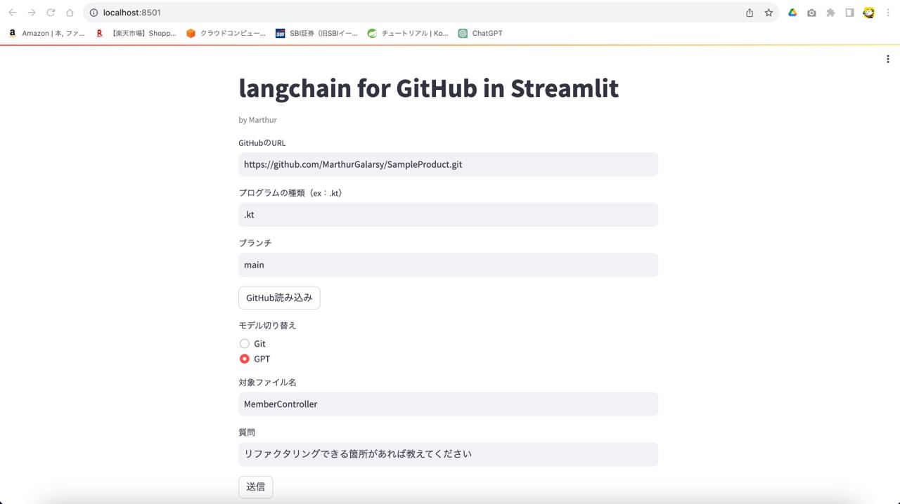
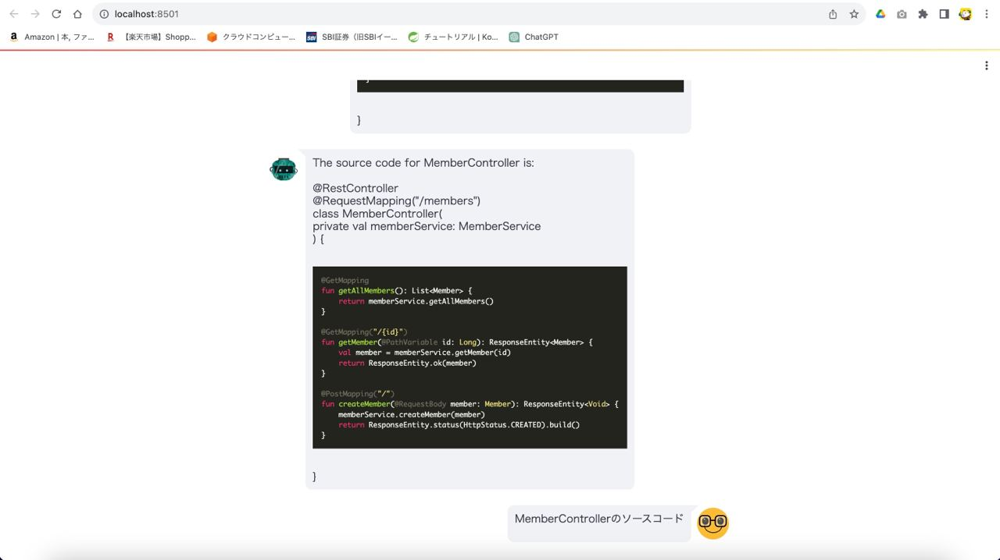
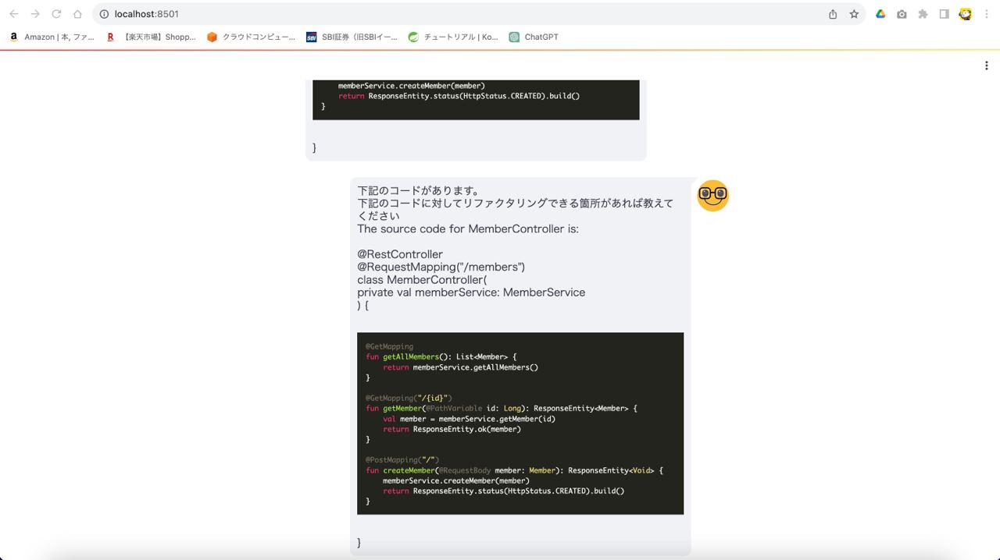
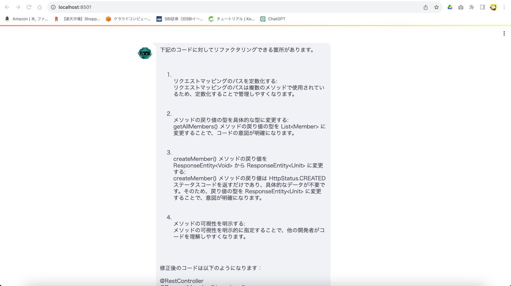
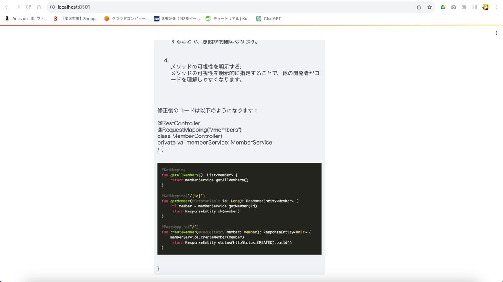

# LangChain + GitLoader + Gpt3.5 + Streamlit
## 使用ソース
* [こちら](./src/lang_chain_git_ui.py)
## 実行結果

## 課題
* VectorstoreIndexCreatorで、VectorStoreにChroma、embeddingにOpenAIEmbeddingsを使用した
    * ソースコードを吐かせるためのプロンプトが安定しない
    * 吐かせたソースコードが完全じゃない（deleteやupdateが抜けている）
* クラス図なども物凄い簡略されたものしか出さず、物足りなさを感じる
* VectorstoreIndexCreatorの使い方にあまり拡張性を感じなかった（本当はもっとできるのかもしれないけど）
* Token数をMaxに近い形にして幾つかの問答を行ったところ、$1.5ほどコストがかかった
## 参考
* https://youtu.be/xEjpMTMy24Y
* https://www.youtube.com/watch?v=Cod-3ymwvsQ