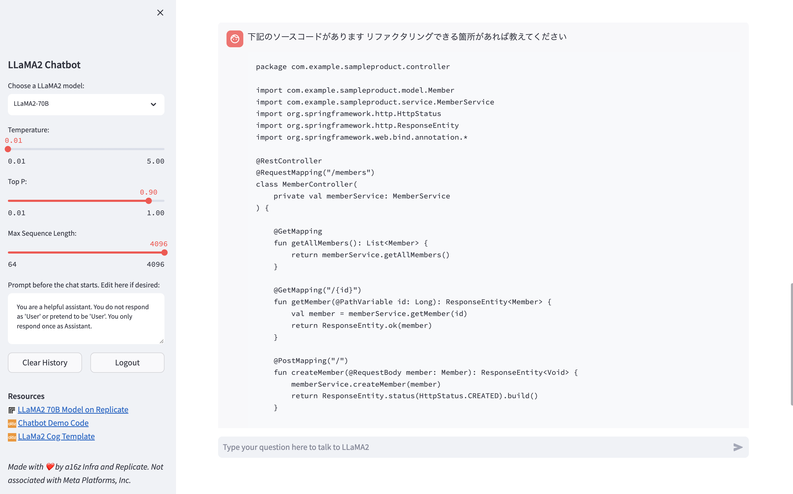

# metaのLLAMA2について
## 概要
* Metaがオープンソースとして出しているLLM
* 商用利用可
* GPT3.5と同等の性能と噂されている
## 使用したモデル
* Llama2-70B（現行で一番良いとされる性能）
## プロンプト

## 回答

## 評価
* あまり期待できない状態
* プロンプトを下記の英語にしても回答が変わらなかった
    * I have the source code below. Please let me know if there is anything I can do to refactor.
* GPT3.5と同様と言われると疑問
* 最低モデルを使用して試してもGPUを使わない場合、1分以上回答に時間がかかるらしい
* 70Bなどの高スペックとされるモデルを使用するとなるとGPUの使用、RAMが最低でも32GBと途端に要求スペックが高くなる
## 参考
* https://llama2.ai/
* https://gigazine.net/news/20230719-llama-2-chatbot/
