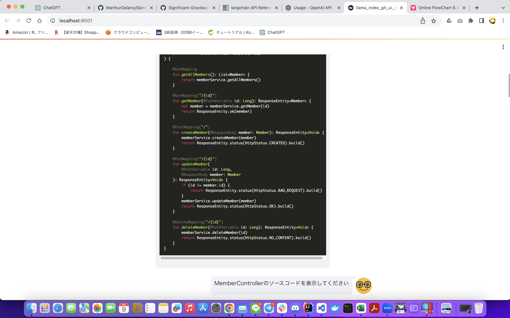

# LlamaIndex（一部LangChain） + Gpt4 + Streamlit
## 変更点
* LlamaIndexがGitHubから持ってきた情報をVectorStoreに格納する部分をGPT-4に変更
* 単ファイル用のGPTモデルをGPT-4に変更
## 使用ソース
* [こちら](./src/llama_index_git_ui_gpt4.py)
## 実行結果
### ソースコード表示

### 全体リファクタリング

### クラス図作成

### リバースエンジニアリング

### SQLの抜き出し

-- ここまでLlama Index --

-- ここからLlama Indexで取得したソースをGPTに投げる --

### 個別リファクタリング

### ソースコードの説明

## 評価、課題
* 現時点で一番理想に近いものとなっている
* コスト面は思ったよりも少ない（上記の全てを実行しても$1.4程度）
* ソースコードを吐かせるプロンプトや出力結果も安定した
* クラス図がプロンプトをそこまで意識せずとも詳細なものを吐く
* プロジェクト全体のリファクタリングを行っても結果が返却されるようになった
* プロダクト全体をリバースエンジニアリングして表示させること自体には成功した（精度は荒い）
* GPT3.5を利用していた頃に比べて全ての回答に時間がかかっている
