# LlamaIndex（一部LangChain） + GitLoader + Gpt3.5 + Streamlit
## 使用ソース
* [こちら](./src/llama_index_git_ui.py)
## 実行結果
### 画面構成
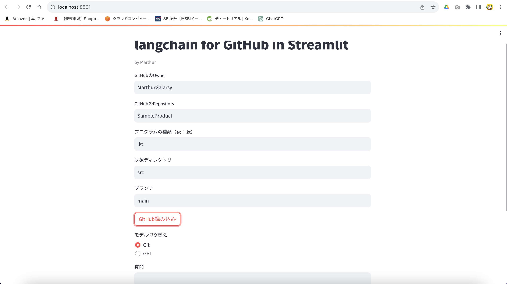
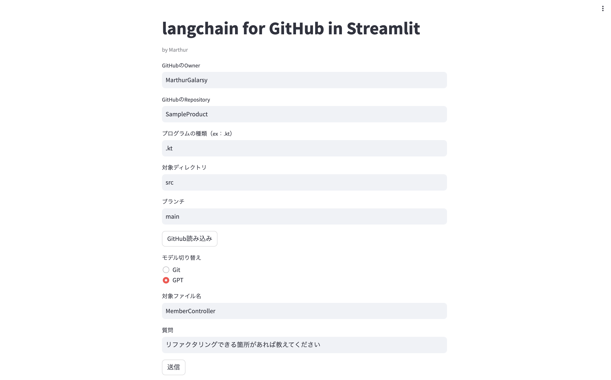
### ソースコード表示
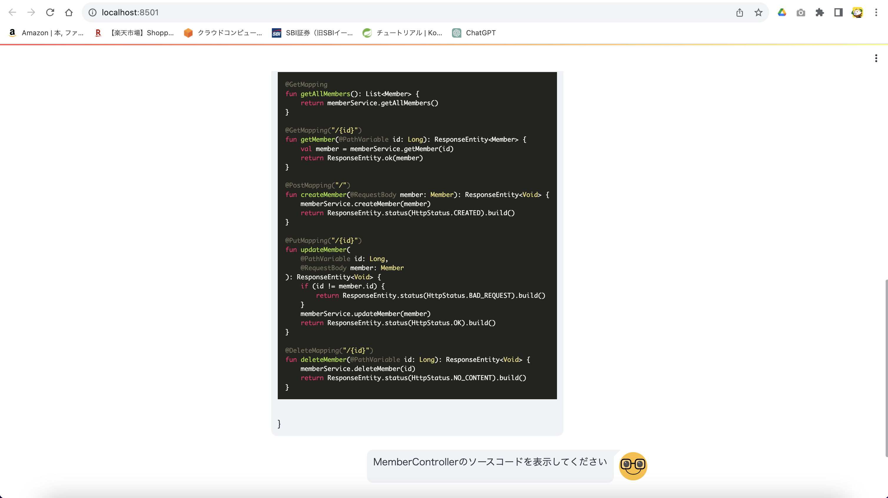
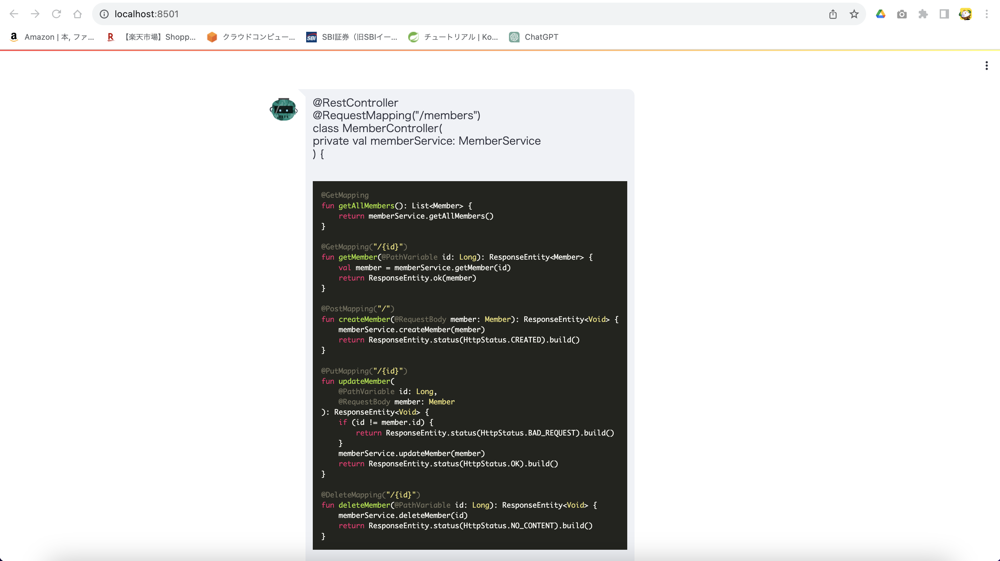
### 処理の概要説明
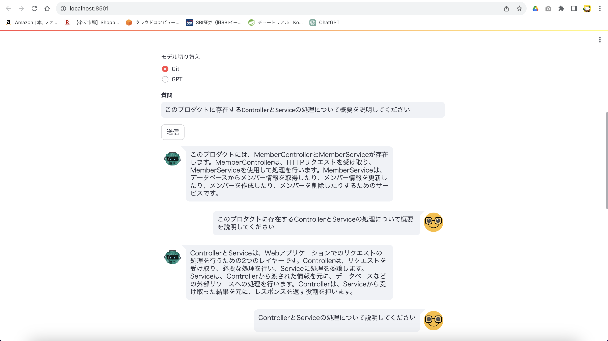
### 全体リファクタリング
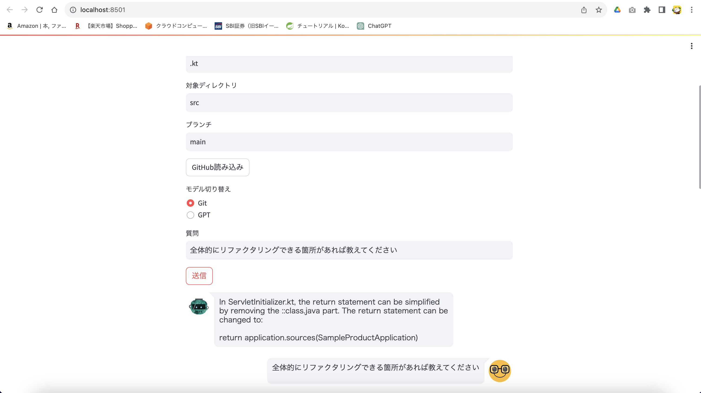
### クラス図
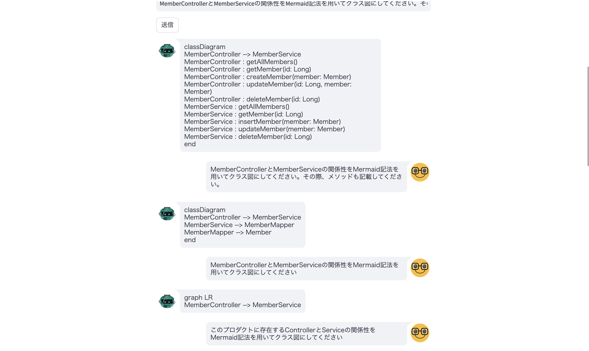

-- ここまでLlama Index --

-- ここからLlama Indexで取得したソースをGPTに投げる --

### 個別リファクタリング
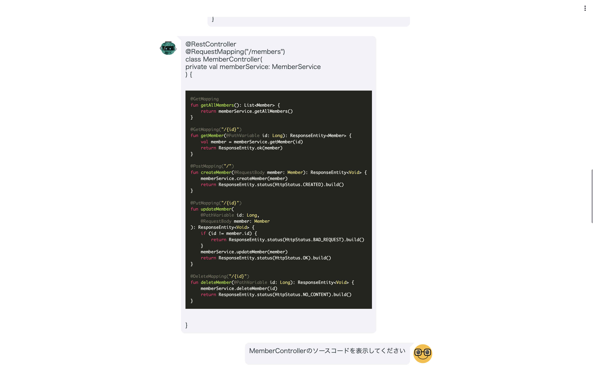
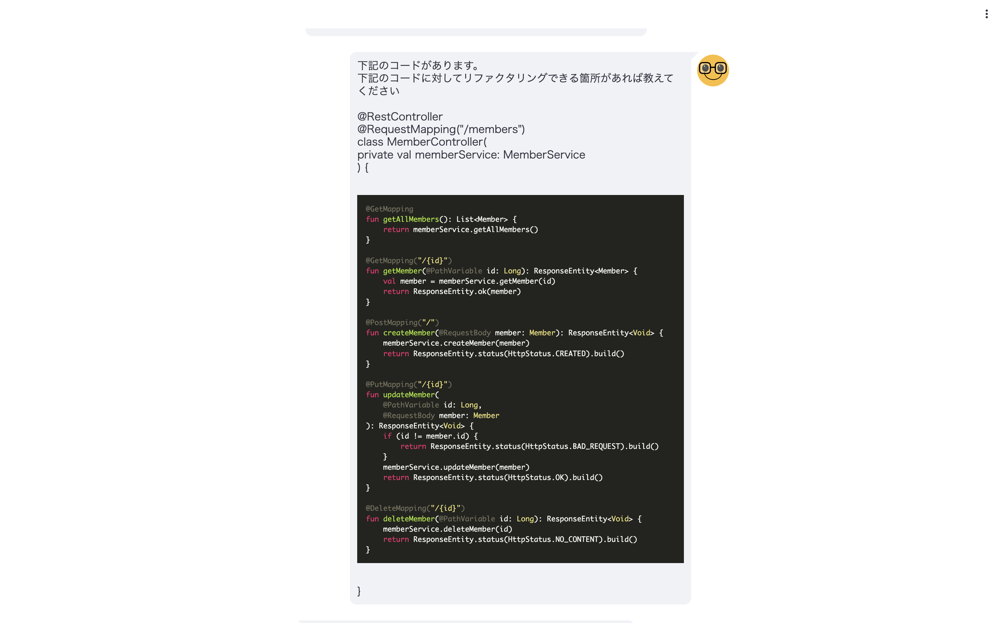
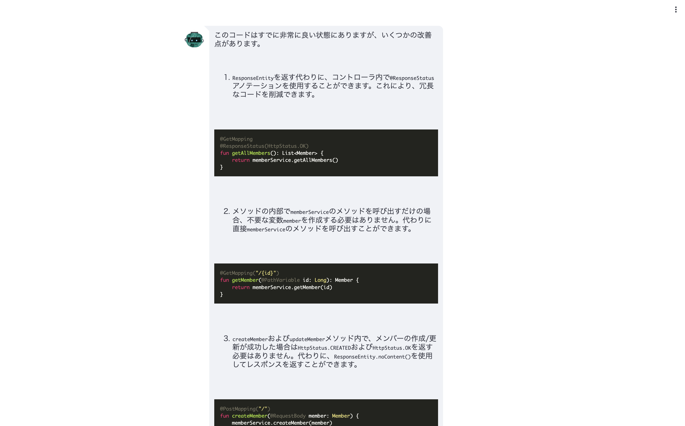
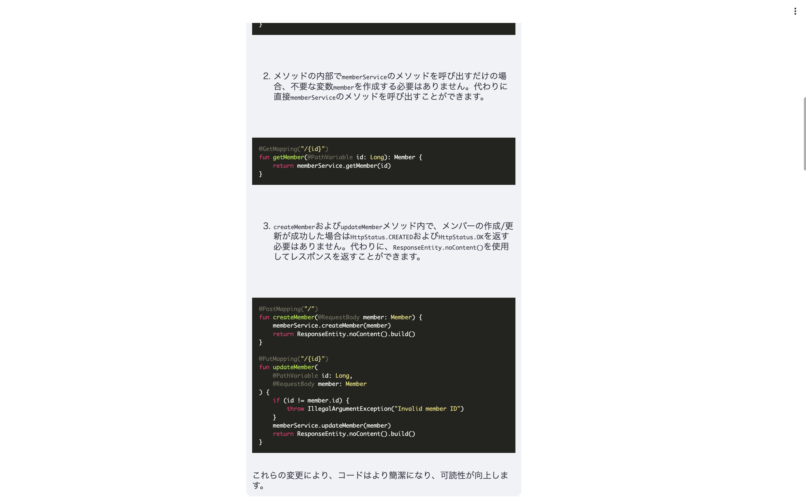
### ソースコードの説明
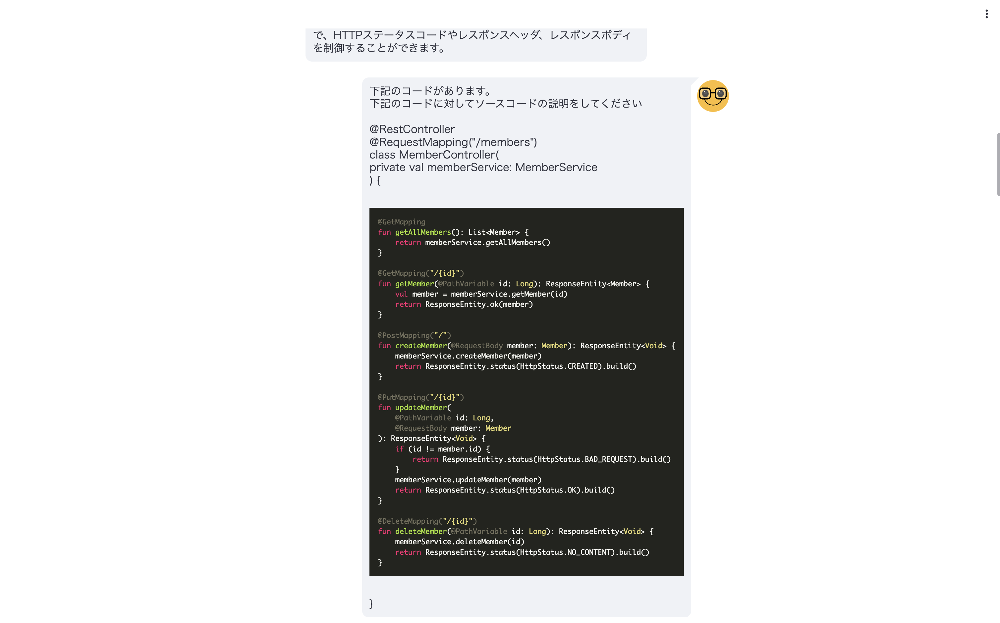
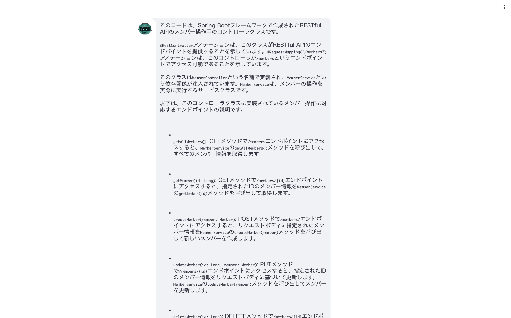
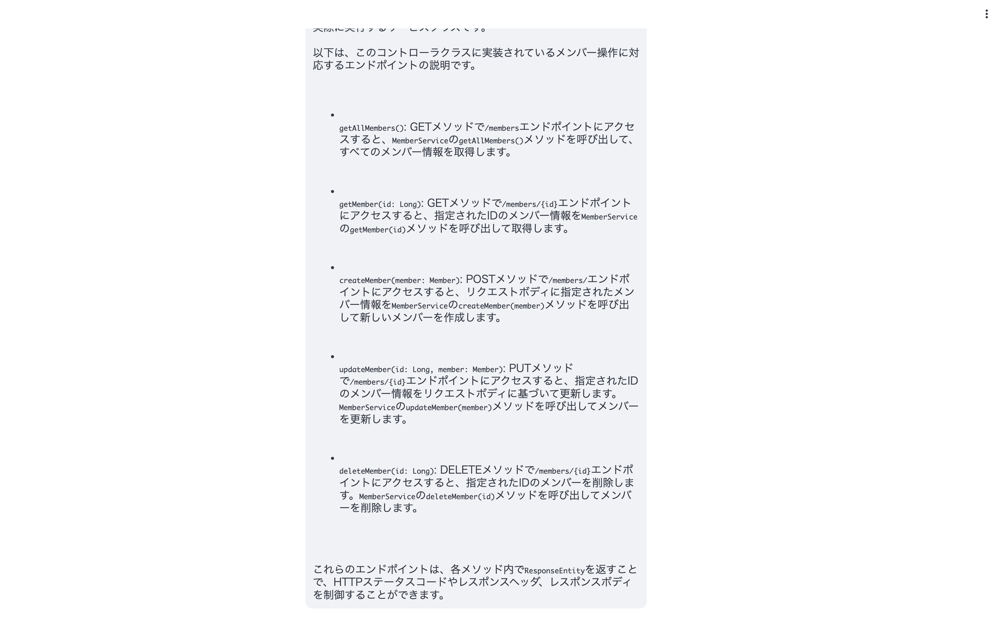
## 評価、課題
* コスト面は同様にかかるものの、ソースコードの読み込みや吐かせる部分などはLangChainよりも精度が高くなった
* ソースコードを吐かせるプロンプトもかなり安定した
* クラス図もプロンプトによってはそれなりに詳細なものを吐くようになった
* リファクタリングなどはソースコード指定でGPTなどを利用した方が精度が高い（プロジェクト全体のリファクタリングは厳しそう）
* 個別リファクタリングや最初のGitHubからの読み込みなどが体感10秒程時間がかかる
## 参考
* https://gpt-index.readthedocs.io/en/latest/index.html
* https://llamahub.ai/l/github_repo
* https://rakuraku-engineer.com/posts/llamaIndex/
